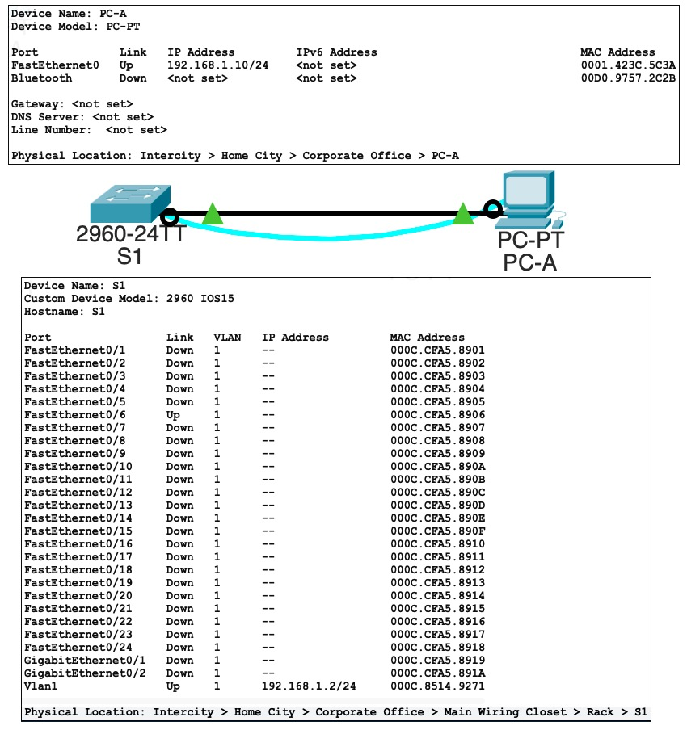
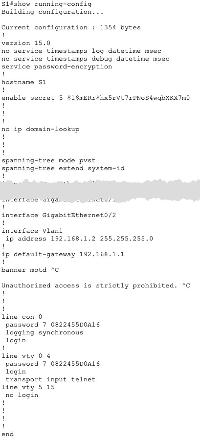
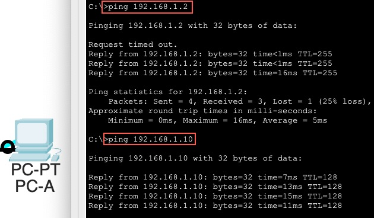
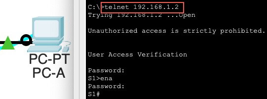

### Инфо
все пароли cisco

## Создание сети и настройка основных параметров устройства 
### Настройте базовые параметры коммутатора.
### Настройте IP-адрес для ПК. 

### Проверка сетевых подключений
#### Отобразите конфигурацию устройства. 

#### Протестируйте сквозное соединение, отправив эхо-запрос. 

#### Протестируйте возможности удаленного управления с помощью Telnet. 
