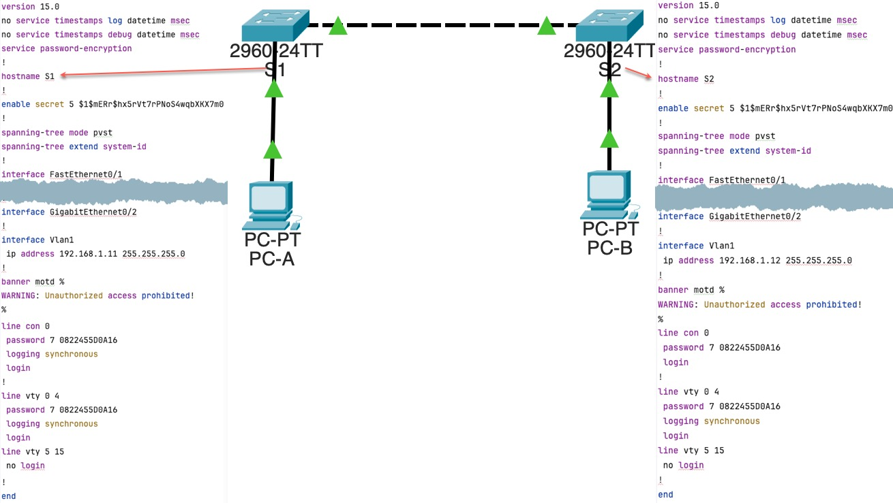
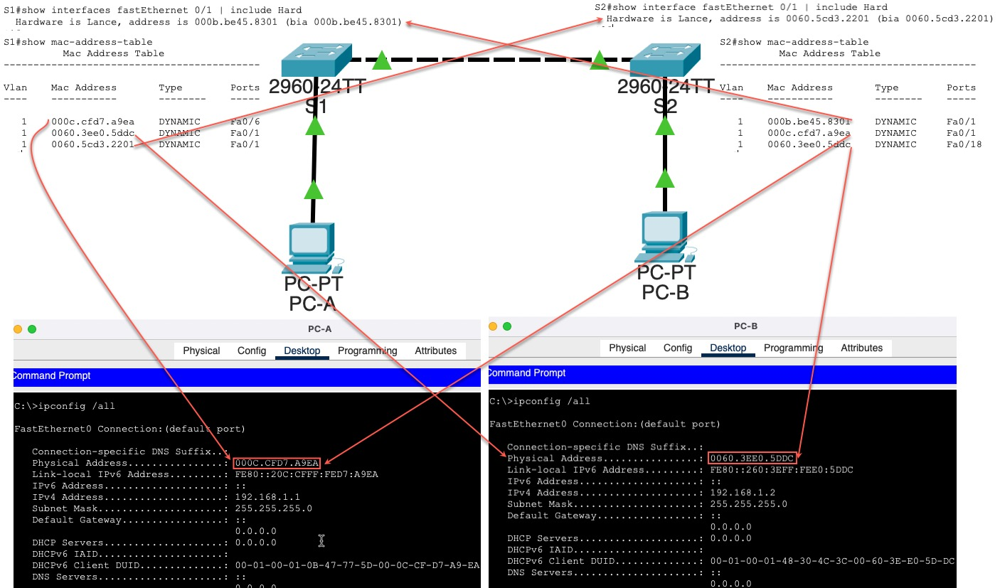
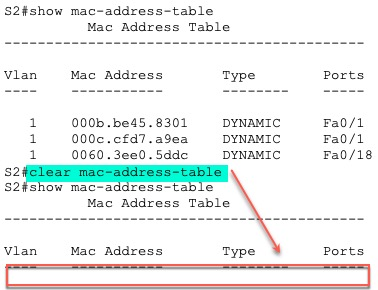
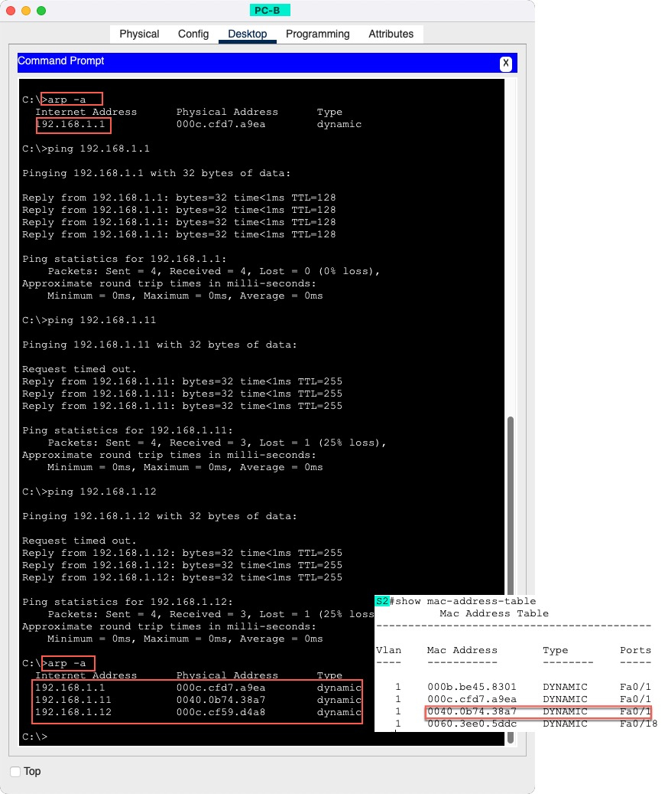

# Инфо
все пароли **cisco**  

файл проекта 
- [HomeWork.pkt](cisco-packet-tracer/HomeWork.pkt) 

конфиги сетевых устройств 
- [Папка configs](cisco-packet-tracer/configs)
- [S1_running-config.txt](cisco-packet-tracer/configs/S1_running-config.txt)
- [S2_running-config.txt](cisco-packet-tracer/configs/S2_running-config.txt)

# Цели
## Часть 1. Создание и настройка сети
- [S1_running-config.txt](cisco-packet-tracer/configs/S1_running-config.txt)
- [S2_running-config.txt](cisco-packet-tracer/configs/S2_running-config.txt)

## Часть 2. Изучение таблицы МАС-адресов коммутатора
### Таблица Mac-адресов

### Очистка Mac-адресов

### Добавление Mac-адресов в кэш после использования ping
