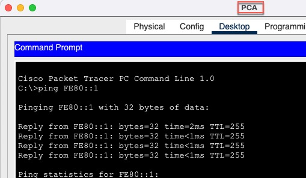

# Инфо
### Пароли
все пароли **cisco**  

файл проекта 
- [HomeWork.pkt](cisco-packet-tracer/HomeWork.pkt) 

конфиги сетевых устройств 
- [Папка configs](cisco-packet-tracer/configs)

# Цели
## Часть 1. Настройка топологии и конфигурация основных параметров маршрутизатора и коммутатора

## Часть 2. Ручная настройка IPv6-адресов
### Роутер

### Коммутатор

### PCA и PCB

## Часть 3. Проверка сквозного подключения
### PCA

### PCB

