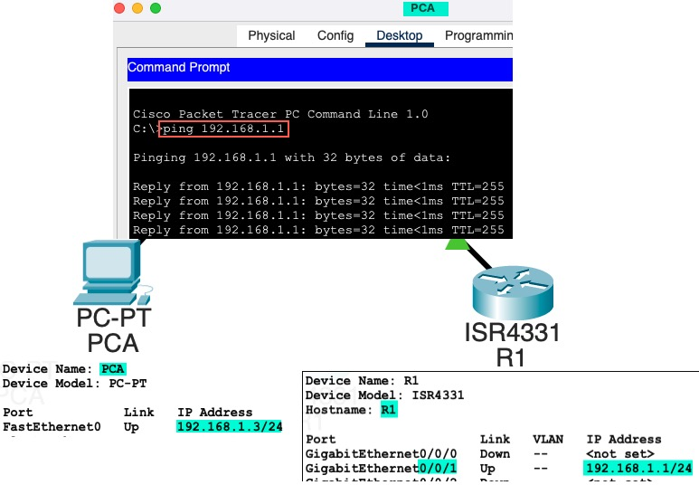
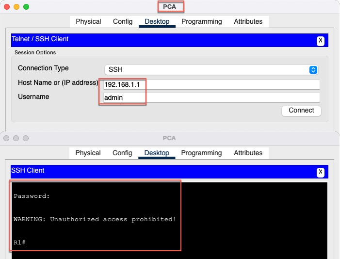
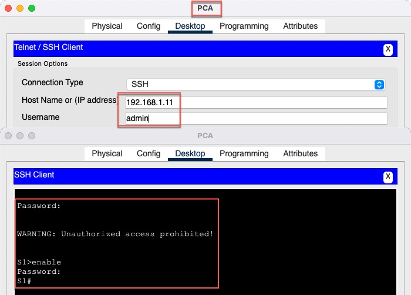
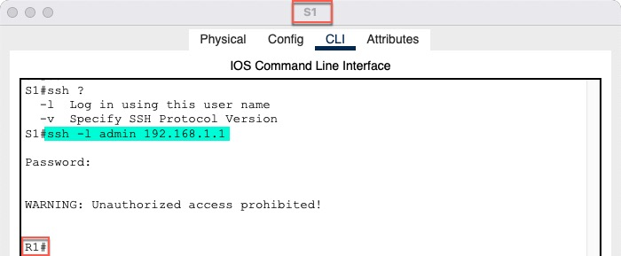

<!-- TOC -->
* [Инфо](#инфо)
    * [Пароли](#пароли)
    * [файл проекта](#файл-проекта-)
        * [конфиги сетевых устройств](#конфиги-сетевых-устройств-)
* [Лабораторная работа. Доступ к сетевым устройствам по протоколу SSH](#лабораторная-работа-доступ-к-сетевым-устройствам-по-протоколу-ssh)
  * [Часть 1. Настройка основных параметров устройства](#часть-1-настройка-основных-параметров-устройства)
    * [Конфиги сетевых устройств](#конфиги-сетевых-устройств--1)
    * [Ping](#ping)
  * [Часть 2. Настройка маршрутизатора для доступа по протоколу SSH](#часть-2-настройка-маршрутизатора-для-доступа-по-протоколу-ssh)
    * [Конфиги сетевых устройств](#конфиги-сетевых-устройств)
    * [SSH connect](#ssh-connect)
  * [Часть 3. Настройка коммутатора для доступа по протоколу SSH](#часть-3-настройка-коммутатора-для-доступа-по-протоколу-ssh)
    * [Конфиги сетевых устройств](#конфиги-сетевых-устройств-1)
    * [SSH connect](#ssh-connect-1)
  * [Часть 4. SSH через интерфейс командной строки (CLI) коммутатора](#часть-4-ssh-через-интерфейс-командной-строки-cli-коммутатора)
    * [SSH connect](#ssh-connect-2)
<!-- TOC -->

# Инфо
### Пароли
все пароли **cisco**  

### файл проекта 
- [HomeWork.pkt](cisco-packet-tracer/HomeWork.pkt) 

##### конфиги сетевых устройств 
- [Папка configs](cisco-packet-tracer/configs)

# Лабораторная работа. Доступ к сетевым устройствам по протоколу SSH
## Часть 1. Настройка основных параметров устройства
### Конфиги сетевых устройств 
- [R1_running-config_part1.txt](cisco-packet-tracer/configs/R1_running-config_part1.txt)

### Ping

## Часть 2. Настройка маршрутизатора для доступа по протоколу SSH
### Конфиги сетевых устройств
[R1_running-config_part2.txt](cisco-packet-tracer/configs/R1_running-config_part2.txt)

### SSH connect

## Часть 3. Настройка коммутатора для доступа по протоколу SSH
### Конфиги сетевых устройств
[S1_running-config_part3.txt](cisco-packet-tracer/configs/S1_running-config_part3.txt)

### SSH connect

## Часть 4. SSH через интерфейс командной строки (CLI) коммутатора
### SSH connect

