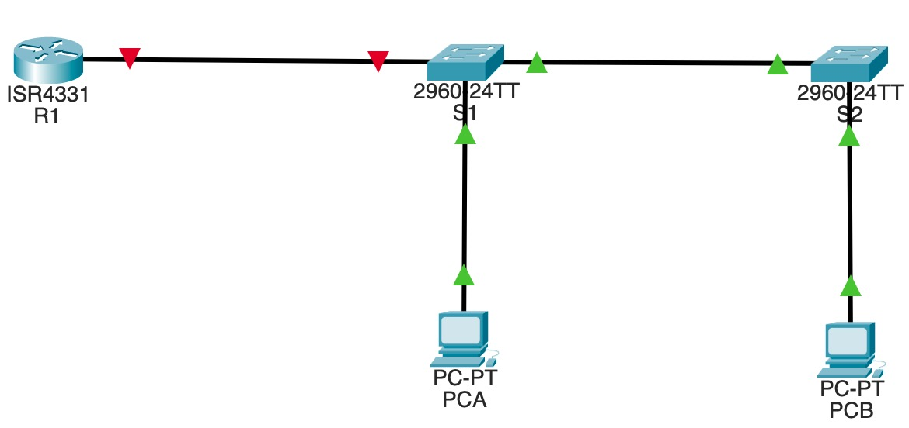
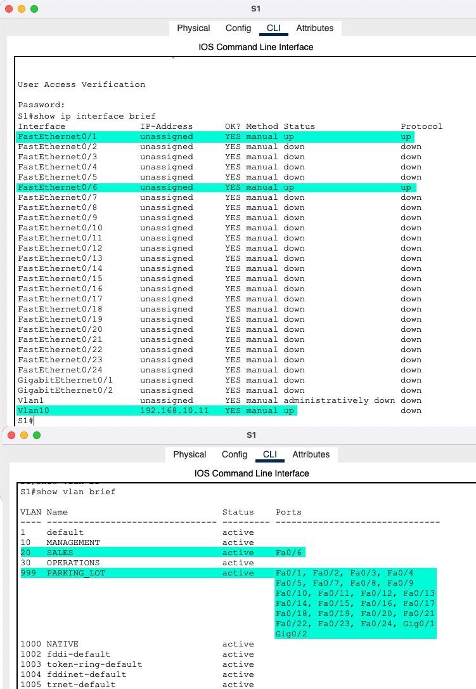
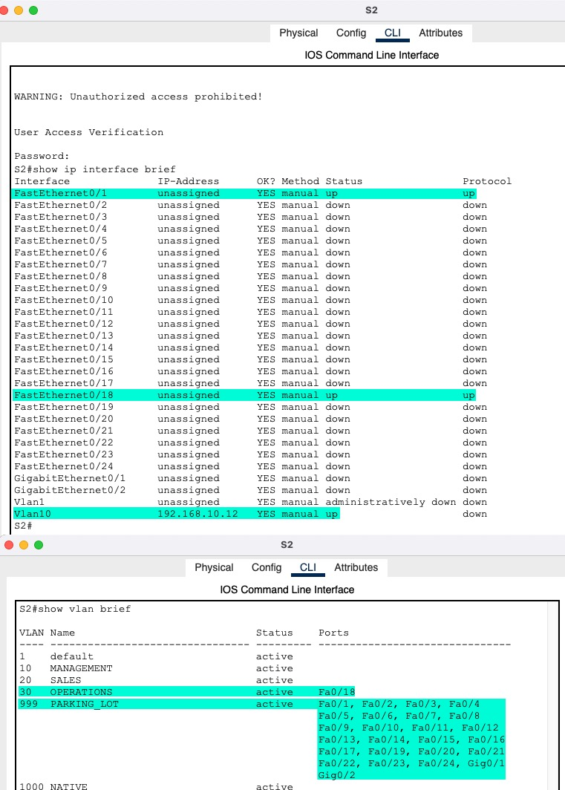
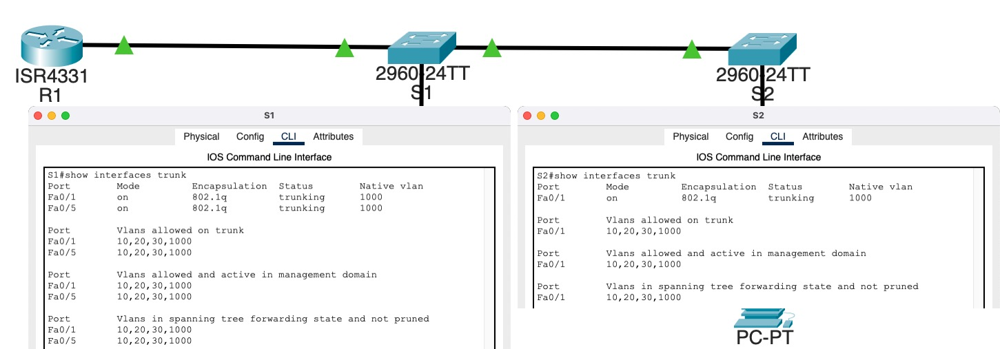
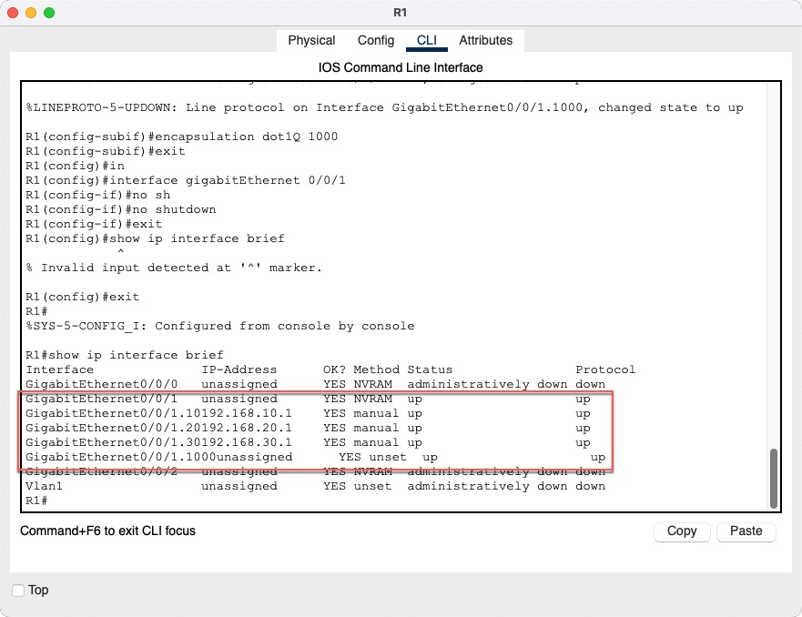
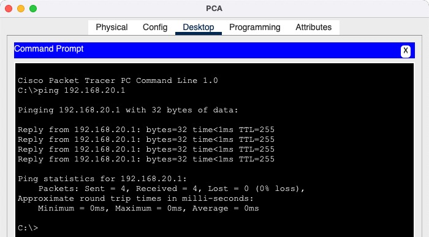
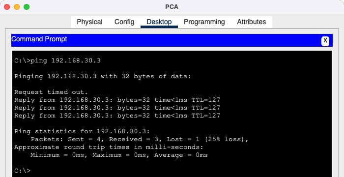
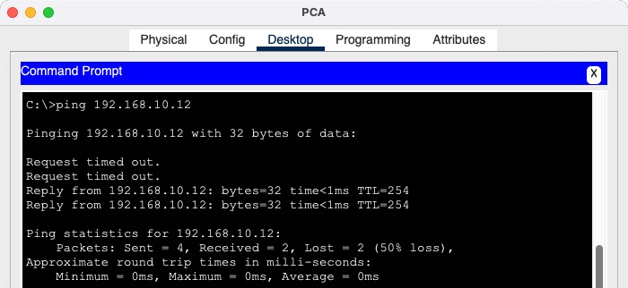
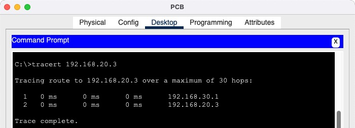

<!-- TOC -->
* [Инфо](#инфо)
    * [Пароли](#пароли)
    * [Файл проекта](#файл-проекта-)
    * [Конфиги сетевых устройств](#конфиги-сетевых-устройств-)
* [Цели](#цели)
  * [Часть 1. Создание сети и настройка основных параметров устройства](#часть-1-создание-сети-и-настройка-основных-параметров-устройства)
    * [Проект на состоянии часть 1](#проект-на-состоянии-часть-1)
    * [Топология](#топология)
  * [Часть 2. Создание сетей VLAN и назначение портов коммутатора](#часть-2-создание-сетей-vlan-и-назначение-портов-коммутатора)
    * [Проект на состоянии часть 2](#проект-на-состоянии-часть-2)
    * [Коммутаторы](#коммутаторы)
      * [S1](#s1)
      * [S2](#s2)
  * [Часть 3. Настройка транка 802.1Q между коммутаторами.](#часть-3-настройка-транка-8021q-между-коммутаторами)
    * [Проект на состоянии часть 3](#проект-на-состоянии-часть-3)
    * [Trunc между коммутаторами](#trunc-между-коммутаторами)
  * [Часть 4. Настройка маршрутизации между сетями VLAN](#часть-4-настройка-маршрутизации-между-сетями-vlan)
    * [Проект на состоянии часть 4](#проект-на-состоянии-часть-4)
    * [Router subinterfaces](#router-subinterfaces)
  * [Часть 5. Проверка, что маршрутизация между VLAN работает](#часть-5-проверка-что-маршрутизация-между-vlan-работает)
    * [PCA ping-и](#pca-ping-и-)
    * [PCB tracert PCA](#pcb-tracert-pca)
<!-- TOC -->

# Инфо
### Пароли
все пароли **cisco**  

### Файл проекта 
- [HomeWork.pkt](cisco-packet-tracer/HomeWork.pkt) 

### Конфиги сетевых устройств 
- [Папка configs](cisco-packet-tracer/configs)

# Цели
## Часть 1. Создание сети и настройка основных параметров устройства
### Проект на состоянии часть 1
[HomeWork_part1.pkt](cisco-packet-tracer/HomeWork_part1.pkt)

### Топология

## Часть 2. Создание сетей VLAN и назначение портов коммутатора
### Проект на состоянии часть 2
[HomeWork_part2.pkt](cisco-packet-tracer/HomeWork_part2.pkt)

### Коммутаторы
#### S1

#### S2

## Часть 3. Настройка транка 802.1Q между коммутаторами.
### Проект на состоянии часть 3
[HomeWork_part3.pkt](cisco-packet-tracer/HomeWork_part3.pkt)
### Trunc между коммутаторами

## Часть 4. Настройка маршрутизации между сетями VLAN
### Проект на состоянии часть 4
[HomeWork_part4.pkt](cisco-packet-tracer/HomeWork_part4.pkt)

### Router subinterfaces

## Часть 5. Проверка, что маршрутизация между VLAN работает
### PCA ping-и 
 
 
 

### PCB tracert PCA
