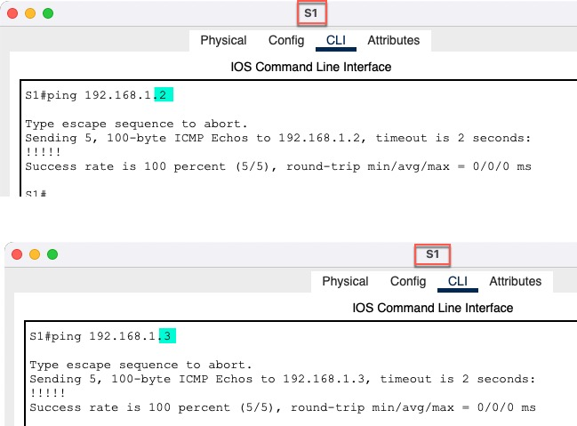
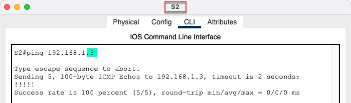

<!-- TOC -->
* [Инфо](#инфо)
    * [Пароли](#пароли)
* [Цели](#цели)
  * [Часть 1. Создание сети и настройка основных параметров устройства](#часть-1-создание-сети-и-настройка-основных-параметров-устройства)
    * [S1](#s1)
    * [S2](#s2)
    * [S3](#s3)
  * [Часть 2. Выбор корневого моста](#часть-2-выбор-корневого-моста)
  * [Часть 3. Наблюдение за процессом выбора протоколом STP порта, исходя из стоимости портов](#часть-3-наблюдение-за-процессом-выбора-протоколом-stp-порта-исходя-из-стоимости-портов)
  * [Часть 4. Наблюдение за процессом выбора протоколом STP порта, исходя из приоритета портов](#часть-4-наблюдение-за-процессом-выбора-протоколом-stp-порта-исходя-из-приоритета-портов)
* [Настройки по проекту](#настройки-по-проекту)
  * [Файл проекта](#файл-проекта-)
  * [Конфиги сетевых устройств](#конфиги-сетевых-устройств-)
<!-- TOC -->


# Инфо
### Пароли
все пароли **cisco** </br>

# Цели
## Часть 1. Создание сети и настройка основных параметров устройства
### S1
```
Switch>enable 
Switch#configure terminal 
Switch(config)#hostname S1
S1(config)#banner motd %
WARNING: Unauthorized access prohibited!
%
S1(config)#no ip domain-lookup
S1(config)#service password-encryption 

S1(config)#line console 0
S1(config-line)#password cisco
S1(config-line)#login
S1(config-line)#logging synchronous
S1(config-line)#service password-encryption

S1(config)#enable secret cisco

S1(config)#line vty 0 4
S1(config-line)#password secret cisco
S1(config-line)#login
S1(config-line)#logging synchronous

S1(config)#interface vlan 1
S1(config-if)#no shutdown 
S1(config-if)#ip address 192.168.1.1 255.255.255.0

S1#copy running-config startup-config
```
### S2
```
Switch>enable
Switch#configure terminal
Switch(config)#hostname S2
S2(config)#banner motd %
WARNING: Unauthorized access prohibited!
%
S2(config)#no ip domain-lookup
S2(config)#service password-encryption

S2(config)#line console 0
S2(config-line)#password cisco
S2(config-line)#login
S2(config-line)#logging synchronous
S2(config-line)#service password-encryption

S2(config)#enable secret cisco

S2(config)#line vty 0 4
S2(config-line)#password secret cisco
S2(config-line)#login
S2(config-line)#logging synchronous

S2(config-line)#interface vlan 1
S2(config-if)#no shutdown
S2(config-if)#ip address 192.168.1.2 255.255.255.0

S2#copy running-config startup-config
```
### S3
```
Switch>enable
Switch#configure terminal
Switch(config)#hostname S3
S3(config)#banner motd %
WARNING: Unauthorized access prohibited!
%
S3(config)#no ip domain-lookup
S3(config)#service password-encryption

S3(config)#line console 0
S3(config-line)#password cisco
S3(config-line)#login
S3(config-line)#logging synchronous
S3(config-line)#service password-encryption

S3(config)#enable secret cisco

S3(config)#line vty 0 4
S3(config-line)#password secret cisco
S3(config-line)#login
S3(config-line)#logging synchronous

S3(config-line)#interface vlan 1
S3(config-if)#no shutdown
S3(config-if)#ip address 192.168.1.3 255.255.255.0

S3#copy running-config startup-config
```
### S1 ping S2, S3


### S2 ping S3


## Часть 2. Выбор корневого моста

## Часть 3. Наблюдение за процессом выбора протоколом STP порта, исходя из стоимости портов

## Часть 4. Наблюдение за процессом выбора протоколом STP порта, исходя из приоритета портов


# Настройки по проекту
## Файл проекта 
- [HomeWork.pkt](cisco-packet-tracer/HomeWork.pkt) 

## Конфиги сетевых устройств 
- [Папка configs](cisco-packet-tracer/configs)


