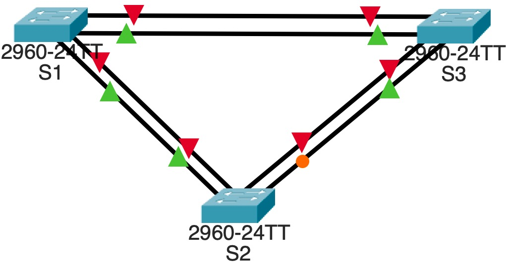
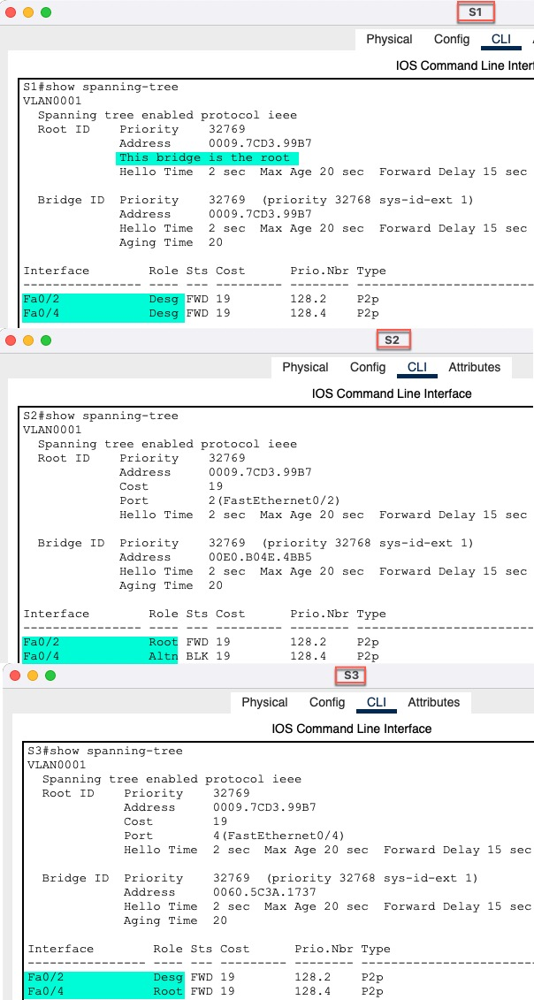
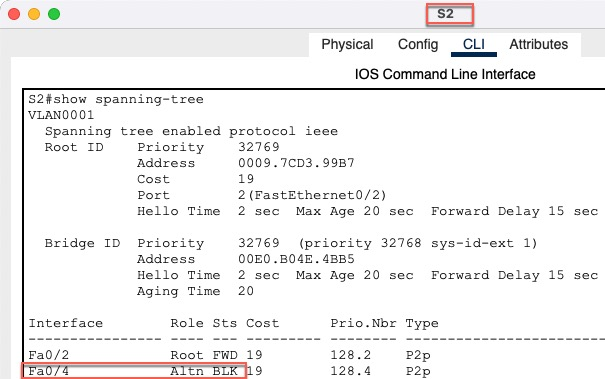
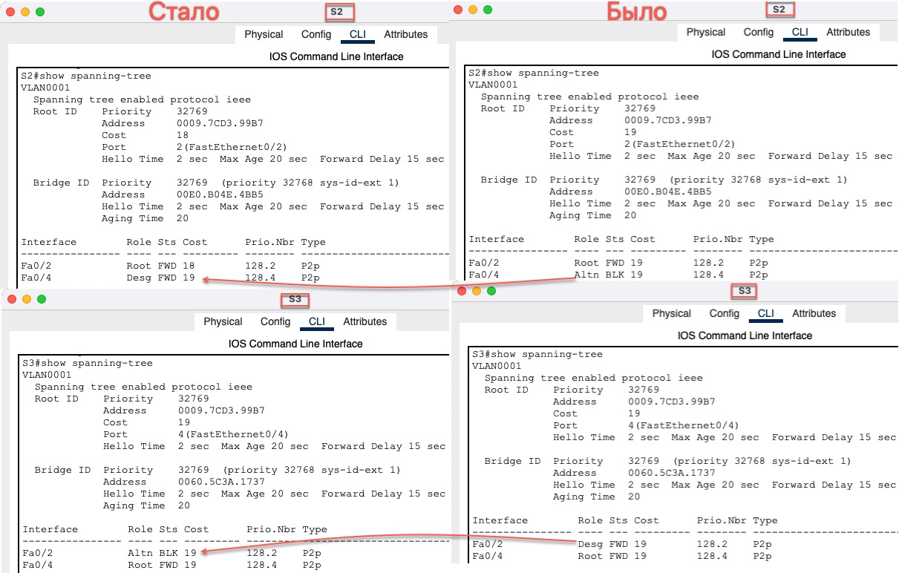
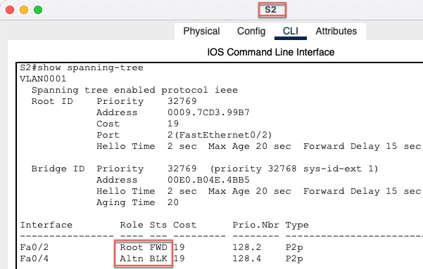
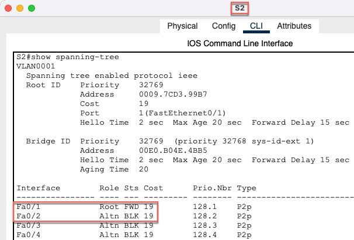

<!-- TOC -->
* [Инфо](#инфо)
    * [Пароли](#пароли)
* [Цели](#цели)
  * [Часть 1. Создание сети и настройка основных параметров устройства](#часть-1-создание-сети-и-настройка-основных-параметров-устройства)
    * [S1](#s1)
    * [S2](#s2)
    * [S3](#s3)
    * [S1 ping S2, S3](#s1-ping-s2-s3)
    * [S2 ping S3](#s2-ping-s3)
  * [Часть 2. Выбор корневого моста](#часть-2-выбор-корневого-моста)
    * [Шаг 1:	Отключите все порты на коммутаторах.](#шаг-1-отключите-все-порты-на-коммутаторах)
      * [S1](#s1-1)
      * [S2](#s2-1)
      * [S3](#s3-1)
    * [Шаг 2:	Настройте подключенные порты в качестве транковых.](#шаг-2-настройте-подключенные-порты-в-качестве-транковых)
      * [S1](#s1-2)
      * [S2](#s2-2)
      * [S3](#s3-2)
    * [Шаг 3:	Включите порты F0/2 и F0/4 на всех коммутаторах.](#шаг-3-включите-порты-f02-и-f04-на-всех-коммутаторах)
      * [S1](#s1-3)
      * [S2](#s2-3)
      * [S3](#s3-3)
    * [Шаг 4:	Отобразите данные протокола spanning-tree.](#шаг-4-отобразите-данные-протокола-spanning-tree)
      * [Роли коммутаторов и портов](#роли-коммутаторов-и-портов)
  * [Часть 3. Наблюдение за процессом выбора протоколом STP порта, исходя из стоимости портов](#часть-3-наблюдение-за-процессом-выбора-протоколом-stp-порта-исходя-из-стоимости-портов)
    * [Шаг 1:	Определите коммутатор с заблокированным портом.](#шаг-1-определите-коммутатор-с-заблокированным-портом)
    * [Шаг 2:	Измените стоимость порта.](#шаг-2-измените-стоимость-порта)
      * [S2](#s2-4)
    * [Шаг 3:	Просмотрите изменения протокола spanning-tree.](#шаг-3-просмотрите-изменения-протокола-spanning-tree)
    * [Шаг 4:	Удалите изменения стоимости порта.](#шаг-4-удалите-изменения-стоимости-порта)
      * [S2](#s2-5)
  * [Часть 4. Наблюдение за процессом выбора протоколом STP порта, исходя из приоритета портов](#часть-4-наблюдение-за-процессом-выбора-протоколом-stp-порта-исходя-из-приоритета-портов)
    * [Шаг 1:	Включите порты F0/1 и F0/3 на всех коммутаторах.](#шаг-1-включите-порты-f01-и-f03-на-всех-коммутаторах)
      * [S1](#s1-4)
      * [S2](#s2-6)
      * [S3](#s3-4)
    * [Шаг 2: Порт корневого моста переместился на порт с меньшим номером](#шаг-2-порт-корневого-моста-переместился-на-порт-с-меньшим-номером)
* [Настройки по проекту](#настройки-по-проекту)
  * [Файл проекта](#файл-проекта-)
  * [Конфиги сетевых устройств](#конфиги-сетевых-устройств-)
<!-- TOC -->


# Инфо
### Пароли
все пароли **cisco** </br>

# Цели
## Часть 1. Создание сети и настройка основных параметров устройства
### S1
```
Switch>enable 
Switch#configure terminal 
Switch(config)#hostname S1
S1(config)#banner motd %
WARNING: Unauthorized access prohibited!
%
S1(config)#no ip domain-lookup
S1(config)#service password-encryption 

S1(config)#line console 0
S1(config-line)#password cisco
S1(config-line)#login
S1(config-line)#logging synchronous
S1(config-line)#service password-encryption

S1(config)#enable secret cisco

S1(config)#line vty 0 4
S1(config-line)#password secret cisco
S1(config-line)#login
S1(config-line)#logging synchronous

S1(config)#interface vlan 1
S1(config-if)#no shutdown 
S1(config-if)#ip address 192.168.1.1 255.255.255.0

S1#copy running-config startup-config
```
### S2
```
Switch>enable
Switch#configure terminal
Switch(config)#hostname S2
S2(config)#banner motd %
WARNING: Unauthorized access prohibited!
%
S2(config)#no ip domain-lookup
S2(config)#service password-encryption

S2(config)#line console 0
S2(config-line)#password cisco
S2(config-line)#login
S2(config-line)#logging synchronous
S2(config-line)#service password-encryption

S2(config)#enable secret cisco

S2(config)#line vty 0 4
S2(config-line)#password secret cisco
S2(config-line)#login
S2(config-line)#logging synchronous

S2(config-line)#interface vlan 1
S2(config-if)#no shutdown
S2(config-if)#ip address 192.168.1.2 255.255.255.0

S2#copy running-config startup-config
```
### S3
```
Switch>enable
Switch#configure terminal
Switch(config)#hostname S3
S3(config)#banner motd %
WARNING: Unauthorized access prohibited!
%
S3(config)#no ip domain-lookup
S3(config)#service password-encryption

S3(config)#line console 0
S3(config-line)#password cisco
S3(config-line)#login
S3(config-line)#logging synchronous
S3(config-line)#service password-encryption

S3(config)#enable secret cisco

S3(config)#line vty 0 4
S3(config-line)#password secret cisco
S3(config-line)#login
S3(config-line)#logging synchronous

S3(config-line)#interface vlan 1
S3(config-if)#no shutdown
S3(config-if)#ip address 192.168.1.3 255.255.255.0

S3#copy running-config startup-config
```
### S1 ping S2, S3


### S2 ping S3


## Часть 2. Выбор корневого моста
### Шаг 1:	Отключите все порты на коммутаторах.
#### S1
```
S1(config)#interface range fa0/1-24, g0/1-2
S1(config-if-range)#shutdown
 
S1(config-if-range)#do show ip interface brief
```
#### S2
```
S2(config)#interface range fa0/1-24, g0/1-2
S2(config-if-range)#shutdown

S2(config-if-range)#do show ip interface brief
```
#### S3
```
S3(config)#interface range fa0/1-24, g0/1-2
S3(config-if-range)#shutdown

S3(config-if-range)#do show ip interface brief
```
### Шаг 2:	Настройте подключенные порты в качестве транковых.
#### S1
```
S1(config)#interface range fa0/1-4
S1(config-if-range)#switchport mode trunk
S1(config-if-range)#switchport nonegotiate

S1#show interfaces status
```
#### S2
```
S2(config)#interface range fa0/1-4
S2(config-if-range)#switchport mode trunk
S2(config-if-range)#switchport nonegotiate

S2#show interfaces status
```
#### S3
```
S3(config)#interface range fa0/1-4
S3(config-if-range)#switchport mode trunk
S3(config-if-range)#switchport nonegotiate

S3#show interfaces status
```
### Шаг 3:	Включите порты F0/2 и F0/4 на всех коммутаторах.
#### S1
```
S1(config)#interface range fa0/2, fa0/4
S1(config-if-range)#no shutdown 

S1(config-if-range)#do show interfaces status
```
#### S2
```
S2(config)#interface range fa0/2, fa0/4
S2(config-if-range)#no shutdown 

S2(config-if-range)#do show interfaces status
```
#### S3
```
S3(config)#interface range fa0/2, fa0/4
S3(config-if-range)#no shutdown

S3(config-if-range)#do show interfaces status
```
### Шаг 4:	Отобразите данные протокола spanning-tree.
#### Роли коммутаторов и портов



## Часть 3. Наблюдение за процессом выбора протоколом STP порта, исходя из стоимости портов
### Шаг 1:	Определите коммутатор с заблокированным портом.


### Шаг 2:	Измените стоимость порта.
#### S2
```
S2(config)#interface f0/2
S2(config-if)#spanning-tree vlan 1 cost 18
```
### Шаг 3:	Просмотрите изменения протокола spanning-tree.


### Шаг 4:	Удалите изменения стоимости порта.
#### S2
``` 
S2(config)#interface f0/2
S2(config-if)#no spanning-tree vlan 1 cost 18
```

## Часть 4. Наблюдение за процессом выбора протоколом STP порта, исходя из приоритета портов
### Шаг 1:	Включите порты F0/1 и F0/3 на всех коммутаторах.
#### S1
```
S1(config)#interface range fa0/1, fa0/3
S1(config-if-range)#no shutdown 

S1(config-if-range)#do show interfaces status
```
#### S2
```
S2(config)#interface range fa0/1, fa0/3
S2(config-if-range)#no shutdown 

S2(config-if-range)#do show interfaces status
```
#### S3
```
S3(config)#interface range fa0/1, fa0/3
S3(config-if-range)#no shutdown

S3(config-if-range)#do show interfaces status
```
### Шаг 2: Порт корневого моста переместился на порт с меньшим номером


# Настройки по проекту
## Файл проекта 
- [HomeWork.pkt](cisco-packet-tracer/HomeWork.pkt) 

## Конфиги сетевых устройств 
- [Папка configs](cisco-packet-tracer/configs)


